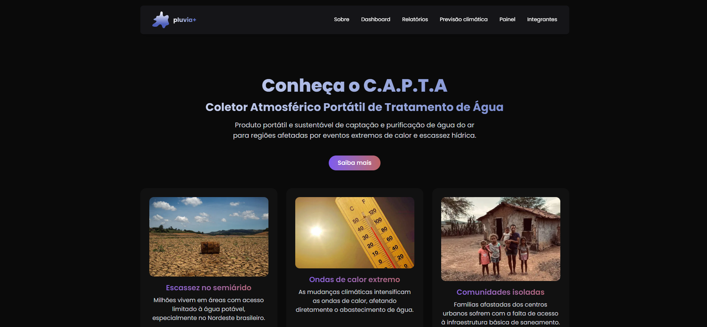
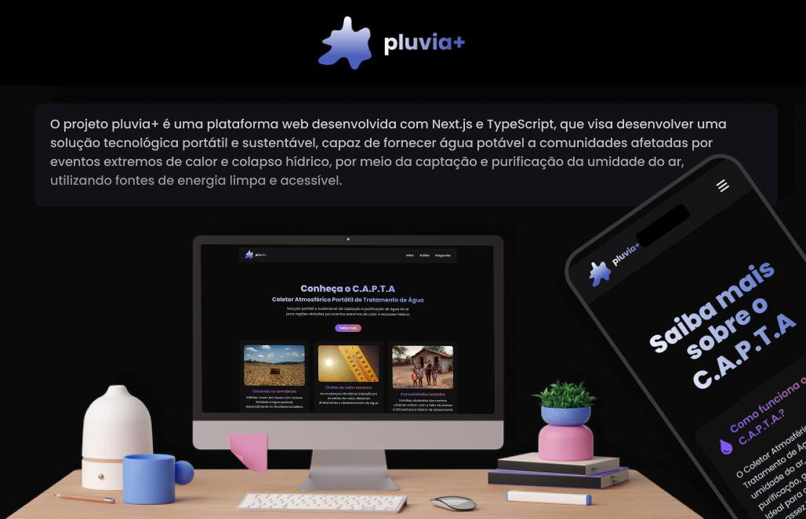

# 🚰 Pluvia+

 

---

## 🚀 Objetivo do projeto

Desenvolver uma produto tecnológico portátil e sustentável, capaz de fornecer água potável a comunidades afetadas por eventos extremos de calor e colapso hídrico, por meio da captação e purificação da umidade do ar, utilizando fontes de energia limpa e acessível.

Foi então criado o produto chamado **C.A.P.T.A. - Coletor Atmosférico Portátil de Tratamento de Água.**

## 💎 Tecnologias e ferramentas

Durante o desenvolvimento do site, foi utilizado as seguintes tecnologias:

[](https://nextjs.org/)
[](https://www.typescriptlang.org/)
[](https://tailwindcss.com/)

[](https://vercel.com/)


## 🖼️ Figma

Toda a interface do usuário foi planejada inicialmente no **Figma** para garantir uma **experiência visual coerente**, **intuitiva** e **responsiva** para todos os dispositivos.



🔗 Acesse o protótipo aqui: [Pluvia+](https://www.figma.com/design/nY0ScjSIDcHnHmQ62SIo0x/Pluvia-?node-id=0-1&t=TluWaAyBk6df3Zbt-1)

---

## ☎️ Consumo de API

- Integração com APIs feita no **Java** para coleta de dados.
- Tratamento de erros e falhas nas requisições, com feedbacks amigáveis para o usuário.

### Principais rotas das APIs:

- GET /dispositivos/resumo
- GET /impactos
- GET /impactos/estatisticas/totais
- GET /previsao-climatica/simulada
- GET /relatorios
- DELETE /relatorios{id}
- GET /producaoagua/estatisticas/volume-por-dispositivo

## ✅ Deploy

A aplicação foi hospedada com sucesso na plataforma Vercel.

*Clique no ícone abaixo para acessar o site hospedado:*

[](https://website-pluvia.vercel.app/)

## 📹 Vídeo no YouTube

Assista à demonstração da aplicação, com as principais funcionalidades e navegação entre telas:

🔗 Acesse o vídeo aqui: [Vídeo explicativo](https://youtu.be/UA7n8dZkl-o)


## 🤔 Como rodar o projeto?

Siga os passos abaixo para executar o projeto na sua máquina:

### 1. Clone o repositório:
```bash
git clone https://github.com/Eventos-Extremos-Gs/website-pluvia.git
```

### 2. Acesse a pasta do projeto
```bash
cd website-pluvia
```

### 3. Instale as dependências
```bash
npm i
```

### 4. Rode o servidor de desenvolvimento
```bash
npm run dev
```

### 5. Para visualizar o projeto rodando
```bash
http://localhost:3000
```

## 👨‍💻 Desenvolvedores

| Dev | Avatar | RM |
| ------------- | ------ | ----- |
|  | <a href="https://github.com/GabrielRossi01"></a> | RM560967 |
|  | <a href="https://github.com/RodrygoYamasaki"></a> | RM560759 |
|  | <a href="https://github.com/castropatrick"></a> | RM559271 |
